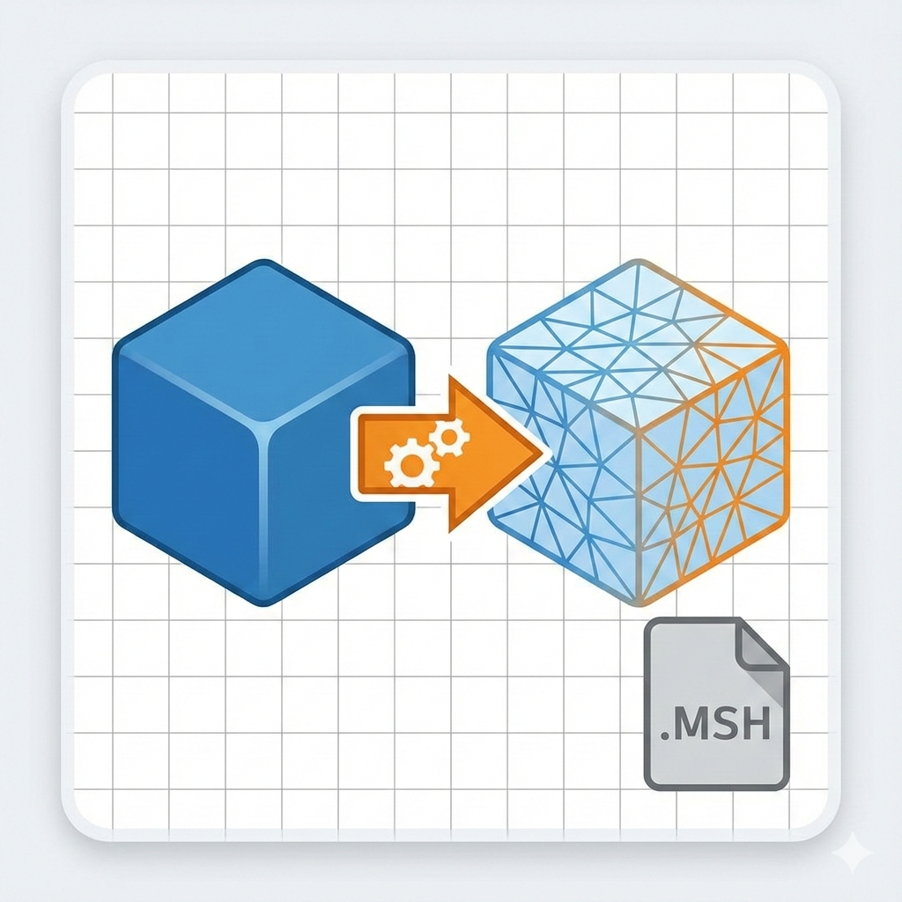
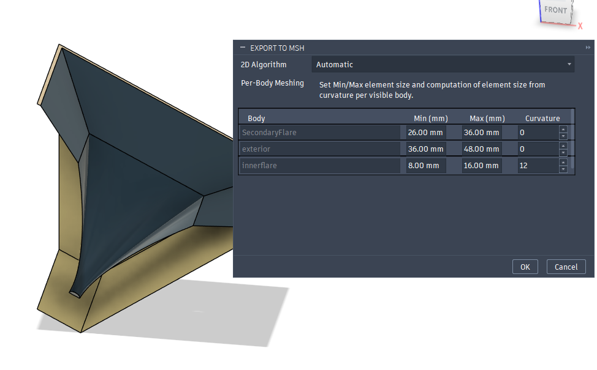

# Fusion to MSH Export (Fusion Script)

  

Autodesk Fusion script for exporting **visible bodies** to configurable **Gmsh `.msh` meshes** for downstream BEM/FEM workflows.

The script adds an **Export to MSH** command in Fusion, exports each selected body as temporary STEP geometry, and generates a 2D mesh in Gmsh with per-body sizing controls.

## Features

- Exports visible **solid and non-solid** bodies from the active design.
- Creates one `.msh` output with physical groups named per body/occurrence.
- Supports per-body mesh controls:
  - Minimum element size
  - Maximum element size
  - Curvature-based sizing weight
- Supports Gmsh 2D algorithms:
  - Automatic
  - MeshAdapt
  - Delaunay
  - Frontal-Delaunay
- Writes ASCII mesh output in Gmsh v2.2 (`.msh`) format for broad compatibility.
- Persists defaults and per-body settings between runs.

## Requirements

- Autodesk Fusion (script runtime)
- Python environment embedded in Fusion

### Gmsh dependency resolution

The script loads the Gmsh library from an included bundled wheel package.

## Repository layout

- `MSHExport.py` — main Fusion script
- `MSHExport.manifest` — Fusion script manifest
- `wheelhouse/` — optional bundled wheels (includes `gmsh-4.15.0-...whl`)

At runtime, the script may create:

- `.gmsh_wheels/` — extracted bundled wheel contents
- `.msh_export_settings.json` — saved mesh defaults and per-body overrides

## Install in Fusion

1. Open Fusion.
2. Go to **Utilities → Scripts and Add-Ins**.
3. Open the **Scripts** tab.
4. Add this folder as a script location if needed.
5. Select `MSHExport` and run it.

## Usage

1. In your design, make target bodies (solid or non-solid) **visible**.
2. Run the script. The **Export to MSH** dialog opens.
3. Choose a 2D meshing algorithm.
4. Adjust per-body `Min`, `Max`, and `Curvature` values.
5. Choose save location for the `.msh` file.
6. The script exports temporary STEP geometry, meshes in Gmsh, and saves the result.

## Mesh control notes

- Fusion internal length units are converted before meshing.
- Curvature is clamped to `0..100`.
- If `Max < Min`, `Max` is adjusted to `Min`.
- Only visible bodies are included.

## Troubleshooting

- **"Gmsh module not found"**
  - Place a compatible `gmsh-*.whl` in `wheelhouse/`, or install `gmsh` in Fusion’s Python environment.
- **No bodies exported**
  - Ensure target bodies are currently **visible**.
- **Unexpected mesh density**
  - Check per-body `Min/Max/Curvature` values and rerun; settings persist in `.msh_export_settings.json`.

## License

This project is licensed under the Creative Commons Attribution-NonCommercial 4.0 International license.

See [LICENSE](LICENSE) for details.
